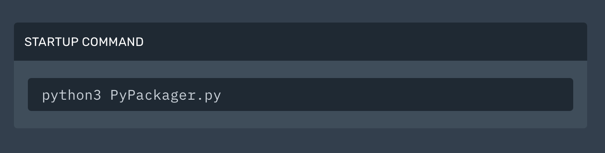

# PyPackager
A python script allowing hosters a simple installation of the modules needed for a discord bot in python. Perfect for small hosting companies.

# Installation

You must first ensure that a file named PyPackager.py is already installed on the hosting server.

Then you must define the command which is executed when the server is started.
Like this:

Just run the server and follow the instructions.

# How to use second option ?

To use the second option you must create a requierements.txt file and mark line by line the modules you want to download.
Like this:

# Note

You can edit in the script the line "Hoster Name" by your hosting provider name.

# Personal Use

PyPackager also works for personal use, launch the PyPackager.py file.

# Important

Please do not remove the credits in the script.
